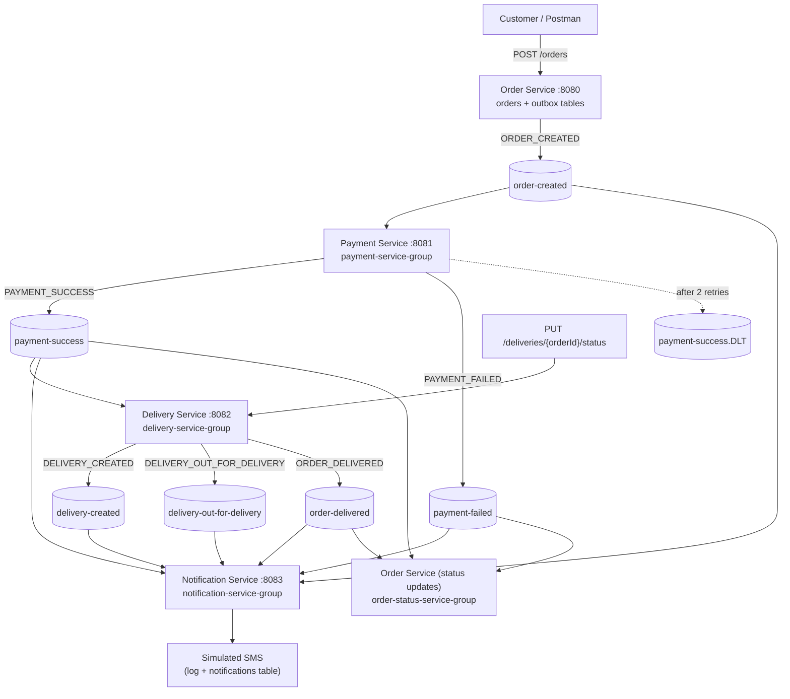
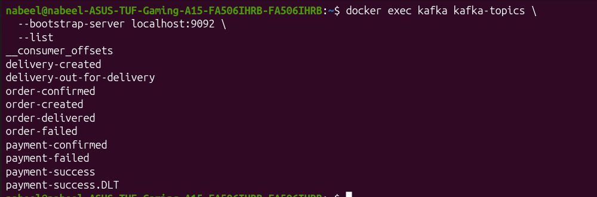
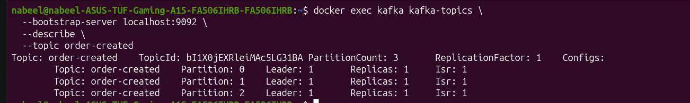
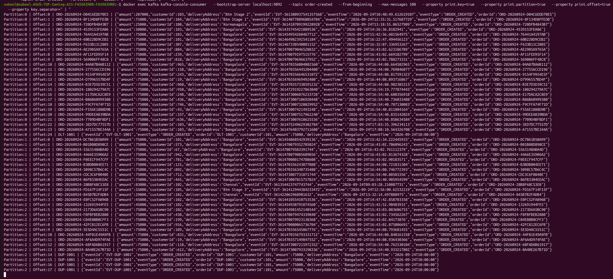
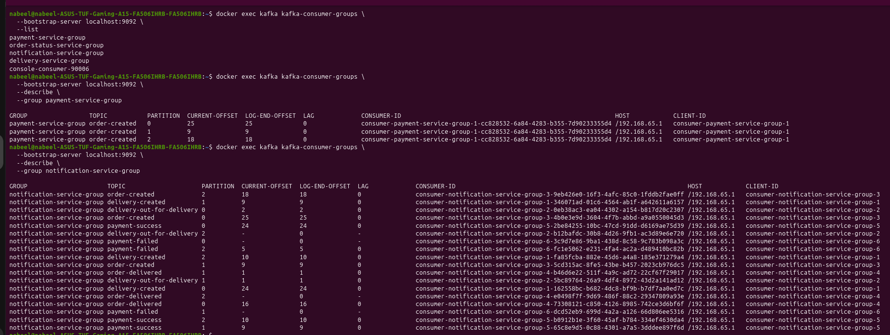
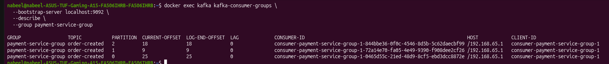
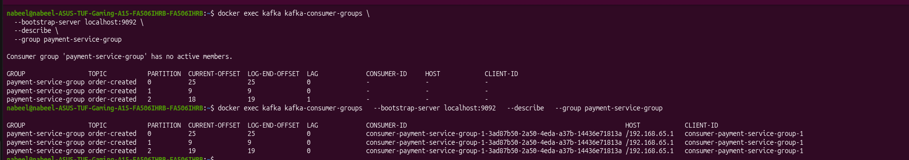
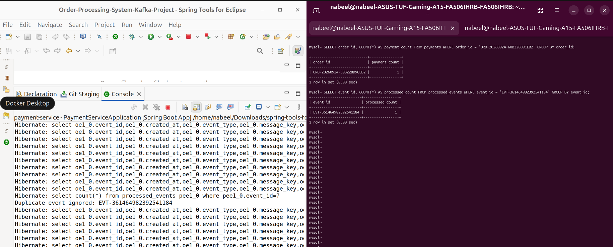
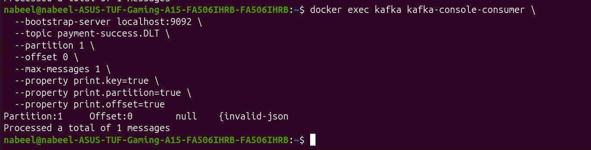
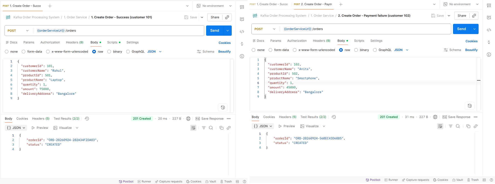

# Kafka — Order Processing System

Event-driven order processing built with **Spring Boot 4**, **Spring Kafka**, **Apache Kafka** and **MySQL** (Java 17, Maven wrapper). It demonstrates asynchronous communication, producers/consumers, consumer groups, partitions, offsets, retries, idempotency and Dead Letter Topics (DLT).

## Repositories

| Service | Port | Responsibility | Repo |
|---|---|---|---|
| Order Service | 8080 | `POST /orders`, stores the order, publishes `ORDER_CREATED`, updates order status from payment/delivery events | [order-service](https://github.com/NabeelFarooq/order-service) |
| Payment Service | 8081 | Consumes `ORDER_CREATED`, processes payment, publishes `PAYMENT_SUCCESS` / `PAYMENT_FAILED` | [payment-service](https://github.com/NabeelFarooq/payment-service) |
| Delivery Service | 8082 | Consumes `PAYMENT_SUCCESS`, creates delivery + tracking number, publishes `DELIVERY_CREATED`; `PUT /deliveries/{orderId}/status` publishes `DELIVERY_OUT_FOR_DELIVERY` / `ORDER_DELIVERED` | [delivery-service](https://github.com/NabeelFarooq/delivery-service) |
| Notification Service | 8083 | Consumes all business events and simulates SMS (log + `notifications` table) | [notification-service](https://github.com/NabeelFarooq/notification-service) |

Each service has its own MySQL database (`order_`, `payment_`, `delivery_`, `notification_processing_system_kafka_project`).

## Architecture Diagram



Failed payment path: `ORDER_CREATED → Payment Service → PAYMENT_FAILED → Notification Service → payment-failure SMS` (and the order becomes `CANCELLED`).

**Design points**
- **Transactional outbox** — a service saves its business row and an `outbox_events` row in one DB transaction; a scheduler publishes `NEW` outbox rows to Kafka every 5 s. Events therefore reach Kafka ~5 s after the action (a full order flow takes ~10–15 s).
- **Idempotent consumers** — Payment, Delivery and Notification store handled `eventId`s in a `processed_events` table and skip duplicates.
- **Retry + DLT** — Payment Service error handler retries a failing record twice (1 s apart), then publishes it to `payment-success.DLT` on the same partition number.
- **Message key = `orderId`** — the same order always maps to the same partition (and to the same partition number in every 3-partition topic).
- **Demo hooks** — customer `102` always gets `PAYMENT_FAILED` (`payment.demo.failure-customer-id`); an `orderId` starting with `DLT-` always fails processing in Payment Service.

## Kafka Topics

All topics: 3 partitions, replication factor 1, key = `orderId`, created automatically by the services on startup (`NewTopic` beans).

| Topic | Event(s) | Producer | Consumer group(s) |
|---|---|---|---|
| `order-created` | `ORDER_CREATED` | Order Service | `payment-service-group`, `notification-service-group` |
| `payment-success` | `PAYMENT_SUCCESS` | Payment Service | `delivery-service-group`, `notification-service-group`, `order-status-service-group` |
| `payment-failed` | `PAYMENT_FAILED` | Payment Service | `notification-service-group`, `order-status-service-group` |
| `delivery-created` | `DELIVERY_CREATED` | Delivery Service | `notification-service-group` |
| `delivery-out-for-delivery` | `DELIVERY_OUT_FOR_DELIVERY` | Delivery Service | `notification-service-group` |
| `order-delivered` | `ORDER_DELIVERED` | Delivery Service | `notification-service-group`, `order-status-service-group` |
| `payment-success.DLT` | records Payment Service could not process | Payment Service error handler | none (inspected manually) |

## Consumer Groups

| Group | Service | Subscribes to |
|---|---|---|
| `payment-service-group` | Payment Service | `order-created` |
| `delivery-service-group` | Delivery Service | `payment-success` |
| `notification-service-group` | Notification Service | `order-created`, `payment-success`, `payment-failed`, `delivery-created`, `delivery-out-for-delivery`, `order-delivered` |
| `order-status-service-group` | Order Service | `payment-success` (→ `CONFIRMED`), `payment-failed` (→ `CANCELLED`), `order-delivered` (→ `DELIVERED`) |

**Event fields** — every event has `eventId`, `eventType`, `orderId`, `customerId`, `eventTime`, plus service-specific fields (amount, paymentId, trackingNumber, …). Example `ORDER_CREATED`:

```json
{"eventId":"EVT-1234567890123456","eventType":"ORDER_CREATED","orderId":"ORD-20260924-3F9A1C7B2D4E","customerId":101,"amount":75000,"deliveryAddress":"Bangalore","eventTime":"2026-09-24T10:15:30.123"}
```

**Concepts** — *Topic*: named stream of events. *Partition*: ordered log inside a topic; same key → same partition. *Offset*: position of a record in a partition; groups commit offsets to resume after a restart. *Producer/Consumer*: apps that write/read events. *Consumer group*: consumers sharing a `group.id`; each partition is read by one member, and every group receives every event.

## Prerequisites

Java 17, MySQL 8 (user `root`), Docker (or a local Apache Kafka install), Postman.

## Setup & Run

**1. Kafka on `localhost:9092`**

```bash
docker run -d --name kafka -p 9092:9092 apache/kafka:latest
```


**2. MySQL databases** (tables are created automatically by Hibernate)

```sql
CREATE DATABASE order_processing_system_kafka_project;
CREATE DATABASE payment_processing_system_kafka_project;
CREATE DATABASE delivery_processing_system_kafka_project;
CREATE DATABASE notification_processing_system_kafka_project;
```

Set your MySQL password in `spring.datasource.password` in each service's `src/main/resources/application.properties`.

**3. Start the services** — clone each repo and run in its own terminal (order, payment, delivery, notification):

In Eclipse IDE, run each repo as Spring Boot App.

Check the topics were created:

```bash
docker exec -it kafka kafka-topics --bootstrap-server localhost:9092 --list
```

**4. Place an order** — import `postman/Kafka_Order_Processing.postman_collection.json`, or:

```bash
curl -X POST http://localhost:8080/orders -H "Content-Type: application/json" \
  -d '{"customerId":101,"customerName":"Rahul","productId":501,"productName":"Laptop","quantity":1,"amount":75000,"deliveryAddress":"Bangalore"}'
```

Response `201 Created`: `{"orderId":"ORD-20260924-3F9A1C7B2D4E","status":"CREATED"}`. After ~10–15 s the Notification Service log shows one line per event:

```
SMS SENT | Customer: 101 | Order: ORD-... | Your order has been created.
SMS SENT | Customer: 101 | Order: ORD-... | Your payment of Rs.75000 was successful.
SMS SENT | Customer: 101 | Order: ORD-... | Your delivery was created. Tracking number: TRK-50001
```

**5. Move the delivery forward** (use the `orderId` returned above; wait until the delivery exists):

```bash
curl -X PUT "http://localhost:8082/deliveries/<orderId>/status?status=OUT_FOR_DELIVERY"
curl -X PUT "http://localhost:8082/deliveries/<orderId>/status?status=DELIVERED"
```

These publish `DELIVERY_OUT_FOR_DELIVERY` and `ORDER_DELIVERED` (SMS sent, order status becomes `DELIVERED`). Delivery statuses: `CREATED`, `IN_TRANSIT`, `OUT_FOR_DELIVERY`, `DELIVERED`, `CANCELLED`.

**6. Failed payment** — order with `"customerId": 102` → `PAYMENT_FAILED` (`INSUFFICIENT_FUNDS`) → SMS `Your payment failed. Reason: INSUFFICIENT_FUNDS` → order status `CANCELLED`.

Order status can be checked in MySQL: `SELECT order_number, order_status FROM orders;` (order database).

## Kafka Exploration (Demo Scenarios)

### 1. Multiple consumers (independent groups)

Place an order, then:

```bash
docker exec -it kafka kafka-consumer-groups \
  --bootstrap-server localhost:9092 \
  --list
docker exec -it kafka kafka-consumer-groups \
  --bootstrap-server localhost:9092 \
  --describe \
  --group payment-service-group
docker exec -it kafka kafka-consumer-groups \
  --bootstrap-server localhost:9092 \
  --describe \
  --group notification-service-group
```

Both groups show the same `order-created` offsets with `LAG 0` — the same event was consumed independently by Payment and Notification.

### 2. Partitions and `orderId` key

```bash
docker exec -it kafka kafka-topics --bootstrap-server localhost:9092 --describe --topic order-created
docker exec -it kafka kafka-console-consumer \
  --bootstrap-server localhost:9092 \
  --topic order-created \
  --from-beginning \
  --property print.key=true \
  --property print.partition=true \
  --property print.offset=true
```

Send ~10 orders (Postman Runner, request 4, 10 iterations). Different `orderId`s spread across the 3 partitions; the same `orderId` always lands in the same partition, so per-order ordering is preserved.

### 3. Consumer scaling

Payment Service instance 1 runs on port 8081 with `event.worker-id=1`. Start two more instances in separate terminals (each needs its own port and worker id, which keeps generated event IDs unique):

1. Start the first Payment Service instance
In Eclipse:
Right-click your payment-service project → Run As → Spring Boot App
Once it starts, stop it for the moment.
Then go to:
Run → Run Configurations...
On the left, select Spring Boot App.
Select your payment-service launch configuration and open the Arguments tab.
Under Program arguments, enter:

`--server.port=8091 --event.worker-id=2`

Then click Apply → Run.

2. Create the second instance

In Run Configurations, select the first configuration and click Duplicate.
Rename it something like:
payment-service-worker-3
Change Program arguments to:

`--server.port=8092 --event.worker-id=3`

Click:
Apply → Run

```bash
docker exec -it kafka kafka-consumer-groups \
  --bootstrap-server localhost:9092 \
  --describe \
  --group payment-service-group
```

The 3 partitions of `order-created` are split across the instances (different `CONSUMER-ID` / `CLIENT-ID` per partition). Send several orders and watch which instance logs each payment. Maximum active consumers per group = number of partitions (3).

### 4. Failure and retry

1. Stop Payment Service.
2. Create an order (Postman request 3) and wait ~5 s for the outbox publisher.
3.  ```bash
    docker exec -it kafka kafka-consumer-groups \
    --bootstrap-server localhost:9092 \
    --describe \
    --group payment-service-group
    ```
  → LAG = 1 , no active member (Notification still sends the "order created" SMS).
4. Start Payment Service → it consumes the pending event, `LAG` returns to `0`, the payment event is published and the flow continues to delivery and SMS.

Offsets are committed only after successful processing, so no event is lost while the service is down.

### 5. Duplicate message (idempotency)

Publish the same `ORDER_CREATED` event (same `eventId`) twice:

```bash
docker exec -it kafka kafka-console-producer \
  --bootstrap-server localhost:9092 \
  --topic order-created \
  --property parse.key=true \
  --property key.separator=:
> DUP-1001:{"eventId":"EVT-DUP-1001","eventType":"ORDER_CREATED","orderId":"DUP-1001","customerId":101,"amount":75000,"deliveryAddress":"Bangalore","eventTime":"2026-09-24T10:00:00"}
> DUP-1001:{"eventId":"EVT-DUP-1001","eventType":"ORDER_CREATED","orderId":"DUP-1001","customerId":101,"amount":75000,"deliveryAddress":"Bangalore","eventTime":"2026-09-24T10:00:00"}
```

Payment Service processes the first and logs `Duplicate event ignored: EVT-DUP-1001` for the second; Notification Service logs `Duplicate notification ignored: EVT-DUP-1001`. Only one payment exists:

```sql
SELECT COUNT(*) FROM payments WHERE order_id = 'DUP-1001';   -- payment database → 1
```

### 6. Dead Letter Topic

Payment Service is coded to fail for any order whose `orderId` starts with `DLT-`. Publish one (use a new `eventId`):

```bash
docker exec -it kafka kafka-console-producer \
  --bootstrap-server localhost:9092 \
  --topic order-created \
  --property parse.key=true \
  --property key.separator=:
> DLT-1001:{"eventId":"EVT-DLT-1001","eventType":"ORDER_CREATED","orderId":"DLT-1001","customerId":101,"amount":75000,"deliveryAddress":"Bangalore","eventTime":"2026-09-24T10:00:00"}
```

Payment Service logs the failure, retries twice (1 s apart) and then publishes the record to the DLT. The consumer is not blocked (`payment-service-group` lag returns to 0).

```bash
docker exec -it kafka kafka-console-consumer \
  --bootstrap-server localhost:9092 \
  --topic payment-success.DLT \
  --from-beginning \
  --property print.key=true \
  --property print.partition=true \
  --property print.headers=true
```

The record is shown with its original key and the `kafka_dlt-*` headers (original topic, partition, offset, exception message).

## Postman Collection

`postman/Kafka_Order_Processing.postman_collection.json` — variables: `orderServiceUrl` (`http://localhost:8080`), `deliveryServiceUrl` (`http://localhost:8082`), `orderId` (saved automatically by request 1).

| # | Request | Purpose |
|---|---|---|
| 1 | Create Order – Success (customer 101) | Full flow; saves `orderId` |
| 2 | Create Order – Payment failure (customer 102) | `PAYMENT_FAILED` → failure SMS → order `CANCELLED` |
| 3 | Create Order – Failure & retry demo | Send while Payment Service is stopped |
| 4 | Create Order – Partition demo | Run 10× in Collection Runner (random customer) |
| 5 | Delivery status – `IN_TRANSIT` | Status change, no event |
| 6 | Delivery status – `OUT_FOR_DELIVERY` | Publishes `DELIVERY_OUT_FOR_DELIVERY` |
| 7 | Delivery status – `DELIVERED` | Publishes `ORDER_DELIVERED` |

Requests 5–7 use the `orderId` of request 1 — wait ~10–15 s after request 1 so the delivery exists.

## Screenshots

**1. Topics** — all seven topics including `payment-success.DLT`


**2. Partitions** — `order-created` described (3 partitions)


**3. Messages** — key, partition and offset per record


**4. Consumer groups** — list + describe of `payment-service-group` and `notification-service-group`


**5. Consumer scaling** — `payment-service-group` with multiple instances


**6. Failure & retry** — lag while Payment Service is down, then `0` after restart


**7. Duplicate event** — duplicate ignored in logs and a single payment row


**8. Dead Letter Topic** — record in `payment-success.DLT`


**9. Postman** — successful and failed-payment order responses


## Demo

Video: `https://drive.google.com/file/d/1E1gJgu6RfQxyB588Cj0BJLMIRu1HjAkQ/view?usp=sharing` — successful flow, failed payment, failure/retry, duplicate event, DLT.
